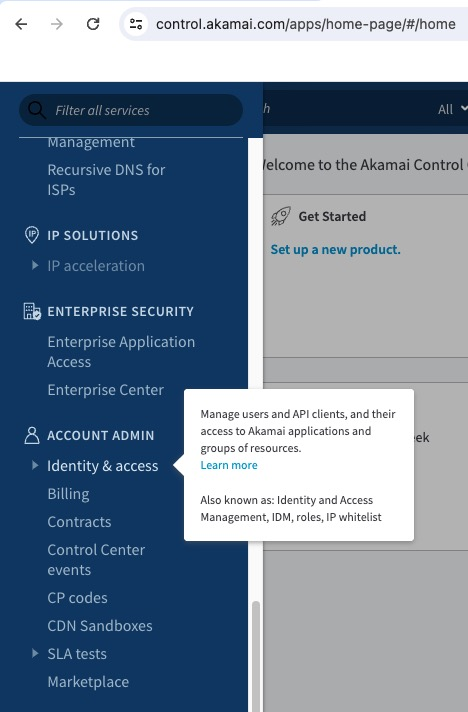
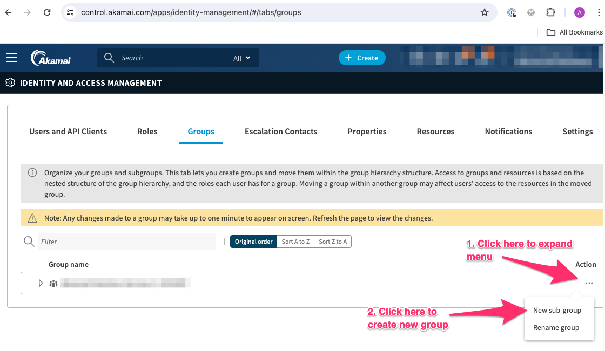
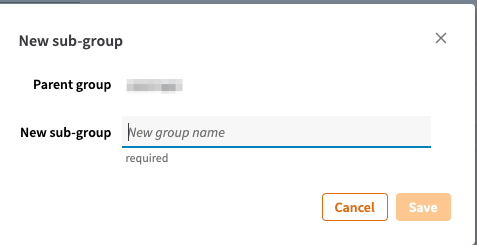
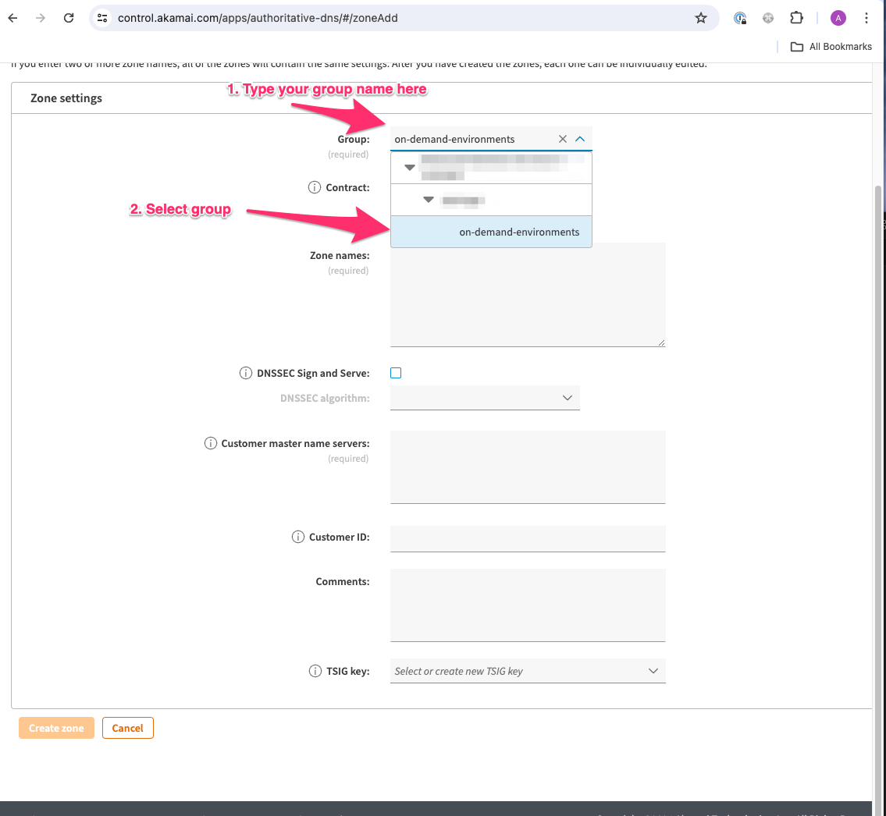
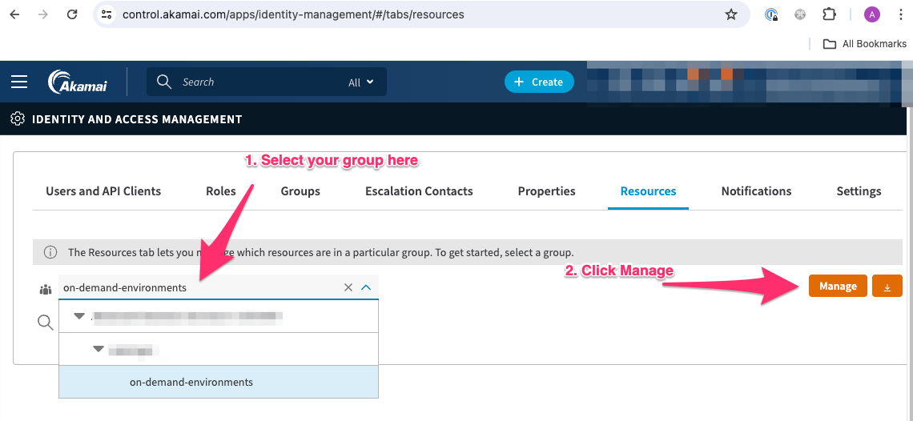

# Akamai Prerequsites
This doc will help you set up the basics in Akamai to support the CI/CD workflow demonstrated in this repository. 

## Assumptions
This document assumes that you already have
- Akamai Contract Account
- User Account
- EdgeWorkers
- Ion
- EdgeDns

## Understanding Akamai Scope
In general Akamai has 2-3 different Scopes:
- Account Scope
- Group Scope/Project Scope

Typically customers have a single account under which they have different resources they manage.  When those resources are scoped by property and roll up to an IAM group permissioning is easy.  You grant access to a group and only get access to the items under that group.  Some resources can be scoped to the Account or be added to a SINGLE group. Most resources do NOT support being assigned to more than a single group.  We want to use groups to limit lateral movement if a set of API credentials are compromised or if a user accidentally uses credentials in the wrong context (it happens). 

## Planning for your security contexts
Different teams have different ideas for security, and how to minimise access and lateral movement.  We recommend creating 3 contexts for this system:
1. on-demand-environments: Credentials for this will be stored in GitHub Actions Secrets and used to create properties, manipulate zones delegated to CI.
1. production: Credentials for this will be stored in GitHub Actions

## Greasing the wheels
Depending on your organization getting security groups, and keys created maybe something you can do or something that you may require help with.  We suggest getting the process moving sooner rather than later so you can stay unblocked.

## Setting Up Property Groups
The CI/CD process in this template will make a new Akamai property for each PR and integration branch. To make cleanup simple we recommend making at least 1 property group for the dynamic environments to make it easier to isolate and clean them up and to prevent accidental access to the production environment.  See [here](https://techdocs.akamai.com/mfa/docs/add-group-manually) for creating groups.

1. Login to control.akamai.com
1. On the left hand navigation bar under `ACCOUNT ADMIN` click `Identity and access`

    

1. Click on the groups tab it should take you to the following [URL](https://control.akamai.com/apps/identity-management/#/tabs/groups)
1. Under your parent group. Click the 3 dots to pull up a contextual menu.  In that menu click create `New sub-group`.
    
1. You will see an on screen modal: 
1. Fill it out.  We again recommend at least 1 group for prod and one for `on-demand-environments`
1. Reload the page.  There is a quirk where once you create the sub-group the page doesn't reload on its own.

## API Keys
We recommend setting up at least 2 keys:
1. Key with access only to the Production Property Group
1. Key with access to the on-demand-property group you just created.

Depending on the development team you may or may not want to provide local credentials for them to use and instead force them to go through the CI/CD workflow.

1. Each group will need an API key created with the following permissions:
    1. Diagnostic Tools
    1. DNS—Zone Record Management 
    1. Edge Diagnostics 
    1. Edge Hostnames API (hapi)  (@todo Can probably remove this now)
    1. EdgeKV
    1. EdgeWorkers
    1. Property Manager (PAPI)

    You can go [here](https://control.akamai.com/apps/identity-management/#/tabs/users/list) to make one.  NOTE do NOT select all API's it will cause errors later. Select only the API's you know you need now. You can always add to them later.
    https://techdocs.akamai.com/developer/docs/set-up-authentication-credentials

    To limit the scope of the key be sure to set "Restrict Groups" to the groups you created earlier. 

## Domain Name
The repo assumes that there is a test domain associated with the project and that each environment will receive a subdomain under that hostname of either
- `pr<N>.hostname.com` 
- `branch-name.hostname.com`
It also assumes that the DNS is managed by Akamai Edge DNS.  This was a conveience as we were writing the default terraform. If this assumption is not valid for your project, please update the terraform accordingly.  You can find those terraform assumptions:
- `terraform/certificate-enrollment.md`
- `terraform/variables.tf#L27

To support this, you'll need to create an Akamai DNS record for your environments' hostnames.  When you create the zones make sure you scope them to your correct groups so that your API-Key can access them.  See 

    

You can follow the instructions [here](https://techdocs.akamai.com/edge-dns/docs/config-prim-zones) to make a new zone and assign it to the correct group. 

If the zone you have created for your development systems is independent of your production environment you may want to adjust your SOA record to drop the REFRESH, RETRY, EXPIRE and TTL values to speed up DNS operations. 

## Assigning other resources to groups
If you have existing resources that you want scoped to your group you can always assign them to the group.  Note a resource can only be assigned to a single group. If you need a key to have access to more than a single group create a parent group and assign the key access to it.  You can assign a resource to a group by:
1. going to the [IAM Resources Tab Here](https://control.akamai.com/apps/identity-management/#/tabs/resources)
1. Select your group from the drop-down.  You can also type it in.
1. Click the orange button that says `Manage`

    
1. The next modal will take a sec to load
1. From here you can select any resources and assign them to your group by checking them and then clicking save.

## Linode Bucket for storing Terraform state
So we aren't quite ready to get into Terraform details but Terraform needs a persistant storage location to track the state of the infrastructure its working with. DON'T use your local machine! Linode Object store is an ideal place for this but you need to set it up and get api credentials for terraform to use.  See [here](https://dev.to/itmecho/setting-up-linode-object-storage-as-a-terraform-backend-1ocb) for how to set it the bucket and key.  You can ignore the Terraform parts.  We will take care of that for you.  Just write down the following
- the region of your bucket.  
- The endpoint which is just `<region>.linodeobjects.com`
- Access Key
- Access Secret

## Gathering all the IDs you need for Terraform
Think of this list as a small worksheet for the next step of [setting up github actions to run this](../github-actions-setup.md)

- Contract ID: [here](https://control.akamai.com/apps/ids-resources/#/accounts/current).  Note include the `C-` e.g `C-1E63747Y` Prefix it with `ctr_` That will become `ctr_1E63747Y`.
- Group ID: [here](https://control.akamai.com/apps/property-manager/) search for your group. Click on it.  Note the numerical values in the URL: `https://control.akamai.com/apps/property-manager/#/groups/123456/properties`  then prefix it with `grp_` so 123456 becomes `grp-123456`.
- You will need your `edge.rc` file you created in the API step. 
- Linode Bucket Name
- Linode Access Key
- Linode Access Secret
- Linode Region
- Linode Endpoint
- Domain for the DNS zone you created.

Now that you have all the pre-requisites collected you can go and [setting up github actions to run this](../github-actions-setup.md)