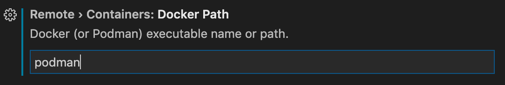

# Getting started locally:
If in doubt you can find the lastest instructions from Microsoft [here](https://code.visualstudio.com/docs/devcontainers/containers)

# Getting Started Locally Windows:
Note: these instructions are experimental and untested.  If you follow them and have learnings please submit your findings as a Pull Request!
1. Install Podman Desktop [https://podman-desktop.io/downloads](https://podman-desktop.io/downloads)
1. Install VSCode: [https://code.visualstudio.com/download](https://code.visualstudio.com/download)
1. Open the VSCode project folder in a terminal window using the command `code .`
1. It will prompt you to install some extensions, just click on "Install" for all of them.
1. It will prompt you to reopen the project in a devcontainer.  DON'T DO IT(yet). 
1. You need to update the Docker Path setting (via Dev > Containers: Docker Path in the Settings editor) to `podman`. 
See [here](https://code.visualstudio.com/remote/advancedcontainers/docker-options) for additional details.

   
1. Click on the blue button in the lower left corner and a context menu will pop up in the top center of the screen select "Reopen In Container"

# Getting Started Locally Mac
All you need to get started for:
1. Install Brew `https://brew.sh/`
1. Install Podman  `brew install podman`
1. Install VSCode `brew install visual-studio-code`
1. Install Podman desktop  `brew install podman-desktop`
1. Open the VSCode project folder in a terminal window using the command `code .`
1. It will prompt you to install some extensions, just click on "Install" for all of them.
1. It will prompt you to reopen the project in a devcontainer.  DON'T DO IT(yet). 
1. You need to update the Docker Path setting (via Dev > Containers: Docker Path in the Settings editor) to `podman`. 
See [here](https://code.visualstudio.com/remote/advancedcontainers/docker-options) for additional details.

   
1. Click on the blue button in the lower left corner and a context menu will pop up in the top center of the screen select "Reopen In Container"
# Getting Started Linux
Note: these instructions are experimental and untested.  If you follow them and have learnings please submit your findings as a Pull Request!
1. Follow instructions to install: [Podman](https://podman.io/docs/installation#installing-on-linux)
1. Follow instructions to install: [VSCode](https://code.visualstudio.com/docs/setup/linux)
1. Open the VSCode project folder in a terminal window using the command `code .`
1. It will prompt you to install some extensions, just click on "Install" for all of them.
1. It will prompt you to reopen the project in a devcontainer.  DON'T DO IT(yet). 
1. You need to update the Docker Path setting (via Dev > Containers: Docker Path in the Settings editor) to `podman`. 
See [here](https://code.visualstudio.com/remote/advancedcontainers/docker-options) for additional details.

   
1. Click on the blue button in the lower left corner and a context menu will pop up in the top center of the screen select "Reopen In Container"

Thats it. Now VSCode is running inside a container and your local development environment should be identical across all projects that use this approach.  The Terminal inside VS code is attached to the container.  OOTB things like `terraform` `tofu` or `akamai` will just work.  Want to add something else to the mix?  Edit [development.Dockerfile] and rebuild your local devcontainer.

# What do I get OOTB in my dev container: 
Locally you get the following installed OOTB:
- Terraform
- Tofu
- Node 22.x
- Go 1.22.x
- Hadolint
- TFLint
- See something missing from the list?  You can simply add by editing your docker container [here](https://github.com/akamai-consulting/ew-hello-world/blob/main/development.Dockerfile).  If you think other teams would benefit share the love and submit a pull request to the Akamai repo.

# Working with Devcontainer
## Managing Devcontainers
You can see all availible DevContainer commands by opening the VSCode command Palette (text box in the top center of the VSCode window) and typing`> dev containers:`.  See [here](https://marketplace.visualstudio.com/items?itemName=ms-vscode-remote.remote-containers#available-commands)

You can also quickly navigate to some of the common DevContainer operations by clicking the VSCode sidebar (the bottom left side of the window) and clicking on the devcontainer icon.

## Rebuilding your DevContainer
So you have changed something in the local dev container or maybe you got an update from your upstream repository.  You can apply the changes to your local development environment by going to the VSCode command Palette and typing `> dev containers: Rebuild Container`.  Note in some cases I have seen it necessary to run `> dev containers: Rebuild Container Without Cache`

