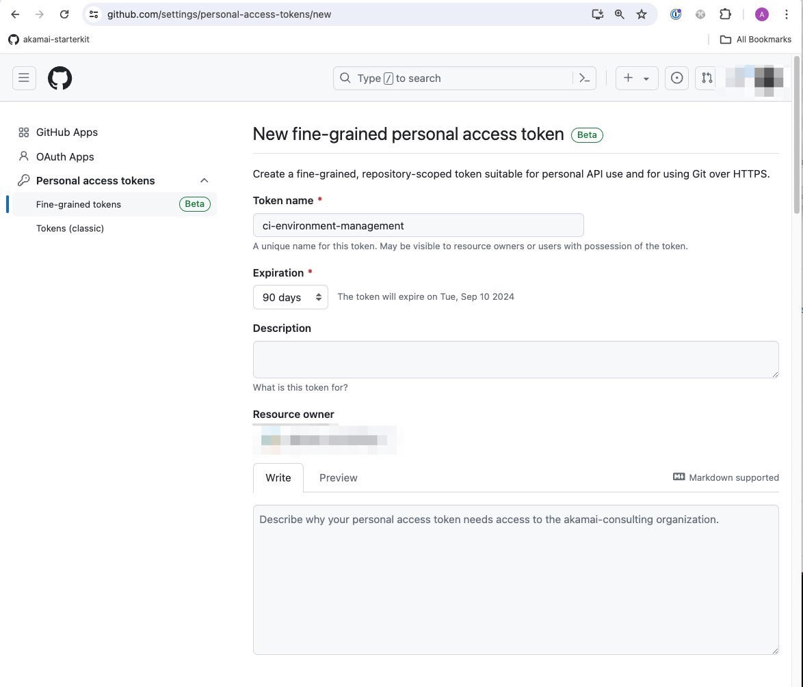
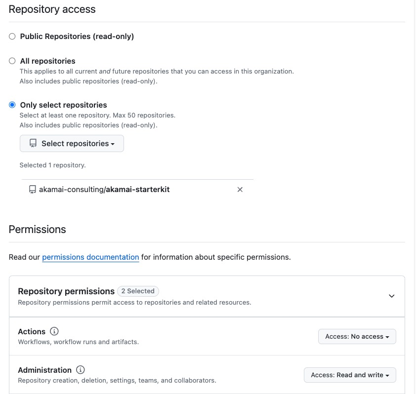

## Setting up CI-CD
This worker expects several secrets and variables to be set in order to run.  If you don't have any we can help you [in Akamai Prerequisites](akamai-prerequisites/akamai-prerequisites.md):

Terraform Keys
- `GROUP_ID`: The group in akamai where new properties will be created.
- `CONTRACT_ID`: The contract for Akamai 
- `EDGERC`: Akamai API key needed by terraform to make changes on the Akamai infrastructue. 
- `BASE_URL`: The name of the URL under edgedns control.

State Bucket Keys:
- `LINODE_ACCESS_KEY`: Keys for using Linode for storing terraform state. 
- `LINODE_SECRET_KEY`: Keys for using Linode for storing terraform state.
- `TF_BACKEND_BUCKET_NAME`: The name of the bucket used for storing TF-state

Note for local development each of these Terraform Keys can be stored in a `/terraform/local-dev.tfvars file.  That TF vars file may be used when invoking TF commands like so:  `tofu plan -var-file=local-dev.tfvars -out tf.plan`. 

The State Bucket Keys are a little different.  You can set them as the ENV variables:  
`AWS_ACCESS_KEY_ID` and `AWS_SECRET_ACCESS_KEY`.  Even though they say AWS this will work for linode.  I know it's confusing! 

When you first invoke terraform init you will be prompted for the bucket. 

## Setting Up Token for Environment Deletion
I really don't love this approach and I feel it has too much control but this is the only way I have found to delete environments from a CI/CD pipeline.  If anyone knows of any other ways please let me know!

1. Create a new personal access token: https://github.com/settings/personal-access-tokens/new
1. Make sure that you select the org where the repo resides and not just your own account!
1. Limit the access to the single repo that is being used for CI/CD pipeline.
1. Grant the token the Administratin permission.
    
    

1. Click the green "Genrate Access Token" button at the bottom of the page
1. Copy the token value
1. In another window go to `https://github.com/<your repo>/settings/secrets/actions`
1. Add a new secret called "ENV_DELETION_ACCESS_TOKEN".  The value for this secret should be the access token that you just created.
